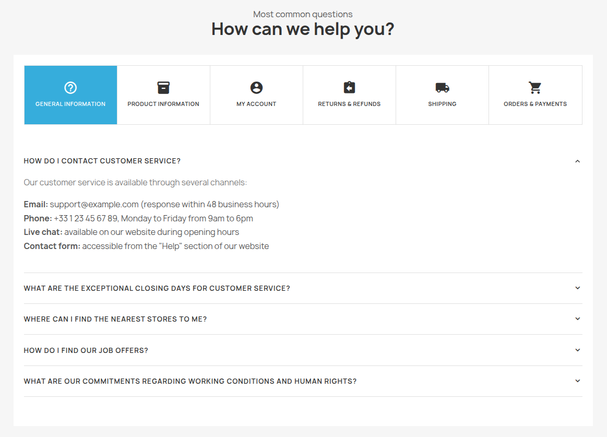
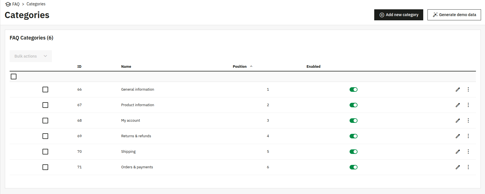
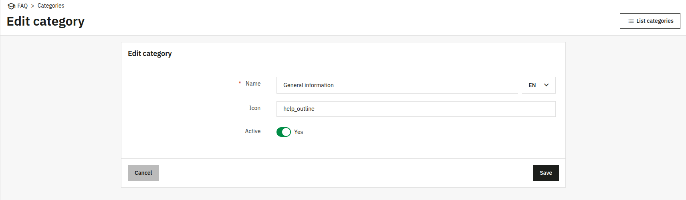
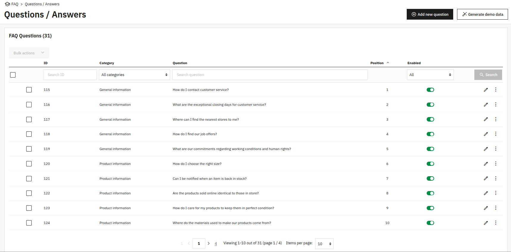
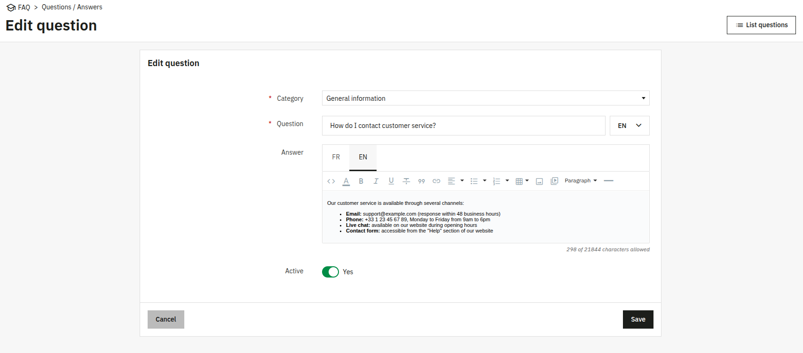

# 🧩 PrestaShop Module: FAQ


FAQ (Frequently Asked Questions) management module for PrestaShop > 8.0.0

## 🚀 Installation

### 1. Clone the repository

Clone the repository into the `modules` folder of your PrestaShop store:

```bash
cd /path/to/your/store/modules
git clone git@github.com:FloFlo-L/prestashop-faq-module.git faq
```

### 2. Install dependencies

Go into the module folder:

```bash
cd faq
```

Install PHP dependencies and regenerate the autoloader:

```bash
composer install
composer dump-autoload
```

### 3. Install the module

**Via command line** (from the root of your PrestaShop store):

```bash
php bin/console prestashop:module install faq
```

**Or via the admin interface**: go to **Modules > Module Manager**, search for "FAQ" and click **Install**.

## ✨ Features

### 🖥️ Front office

A dedicated FAQ page displays categories as horizontal tabs with icons, and questions as an accordion within each category. The page is fully responsive with horizontal scrolling on mobile. The design is built to integrate seamlessly with the native Hummingbird theme.

The FAQ page is accessible at `/faq`.



### ⚙️ Back office

The module adds a **FAQ** menu in the back office with two sub-entries. Both grids support sorting, drag-and-drop reordering, per-row active toggle, bulk enable/disable/delete, and create/edit forms.

#### 📁 Categories

Grid listing all FAQ categories with their name, icon, position and active status. A **Generate demo data** button populates the FAQ with a default set of categories out of the box.



The create/edit form lets you set the category name (multilingual), a Material Icons icon name, and the active status.



#### ❓ Questions & Answers

Grid listing all questions with their category, question text, position and active status. Supports filtering by category, question text and active status. A **Generate demo data** button populates the FAQ with a default set of questions out of the box.



The create/edit form lets you set the category, the question (multilingual), the answer via a rich-text editor (multilingual), and the active status.



#### 🔧 Configuration

A **Configuration** page lets you set:

- 📝 **Page title** — small label displayed above the main heading (multilingual).
- 💬 **Page subtitle** — main heading of the FAQ page (multilingual).

If left empty, the page falls back to a default "Frequently Asked Questions" label.

## 🔬 Technical reference

For hooks, admin routes and database schema, see [TECHNICAL.md](TECHNICAL.md).
