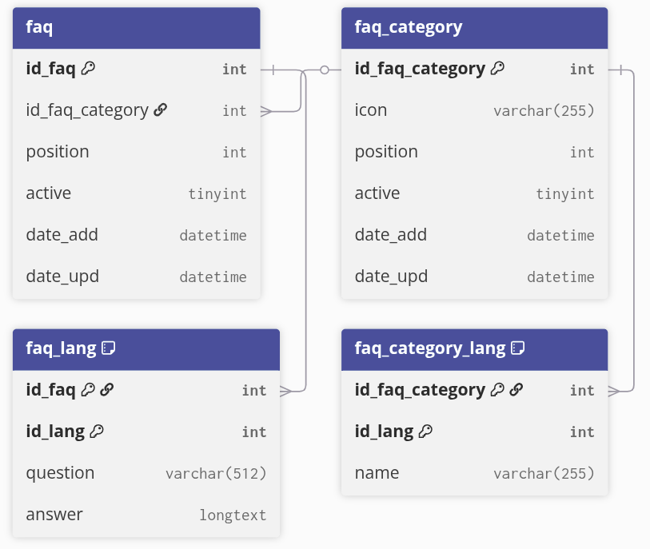

# 🔬 Technical reference

## 🪝 Hooks

| Hook           | Description                                                     |
| -------------- | --------------------------------------------------------------- |
| `moduleRoutes` | Registers the `/faq` friendly URL for the front office FAQ page |

The hook is registered automatically on module install. The URL rule can be changed in `hookModuleRoutes()` inside `faq.php`.

## 🛣️ Routes

### Front office

| Name | Method | Path | Description |
|---|---|---|---|
| `module-faq-faq` | GET | `/faq` | FAQ page |

### Admin

| Name                           | Method   | Path                               | Description        |
| ------------------------------ | -------- | ---------------------------------- | ------------------ |
| `faq_configuration`            | GET/POST | `/faq/configuration`               | Configuration page |
| `faq_generate`                 | GET/POST | `/faq/generate`                    | Generate demo data |
| `faq_category_index`           | GET      | `/faq/category`                    | Categories list    |
| `faq_category_create`          | GET/POST | `/faq/category/create`             | Create category    |
| `faq_category_edit`            | GET/POST | `/faq/category/{id}/edit`          | Edit category      |
| `faq_category_delete`          | POST     | `/faq/category/{id}/delete`        | Delete category    |
| `faq_category_toggle_active`   | POST     | `/faq/category/{id}/toggle-active` | Toggle category    |
| `faq_category_update_position` | POST     | `/faq/category/update-position`    | Reorder categories |
| `faq_category_enable_bulk`     | POST     | `/faq/category/enable-bulk`        | Bulk enable        |
| `faq_category_disable_bulk`    | POST     | `/faq/category/disable-bulk`       | Bulk disable       |
| `faq_category_delete_bulk`     | POST     | `/faq/category/delete-bulk`        | Bulk delete        |
| `faq_question_index`           | GET      | `/faq/question`                    | Questions list     |
| `faq_question_create`          | GET/POST | `/faq/question/create`             | Create question    |
| `faq_question_edit`            | GET/POST | `/faq/question/{id}/edit`          | Edit question      |
| `faq_question_delete`          | POST     | `/faq/question/{id}/delete`        | Delete question    |
| `faq_question_toggle_active`   | POST     | `/faq/question/{id}/toggle-active` | Toggle question    |
| `faq_question_update_position` | POST     | `/faq/question/update-position`    | Reorder questions  |
| `faq_question_enable_bulk`     | POST     | `/faq/question/enable-bulk`        | Bulk enable        |
| `faq_question_disable_bulk`    | POST     | `/faq/question/disable-bulk`       | Bulk disable       |
| `faq_question_delete_bulk`     | POST     | `/faq/question/delete-bulk`        | Bulk delete        |

## 🔑 Configuration keys

| Key | Type | Description |
|---|---|---|
| `FAQ_PAGE_TITLE` | string (multilingual) | Small label displayed above the main heading |
| `FAQ_PAGE_SUBTITLE` | string (multilingual) | Main heading of the FAQ page |

Values are stored per language in the PrestaShop `ps_configuration` table. If empty, the page falls back to a default "Frequently Asked Questions" label.

## 🗄️ Database schema

Four tables are created on install and dropped on uninstall.

